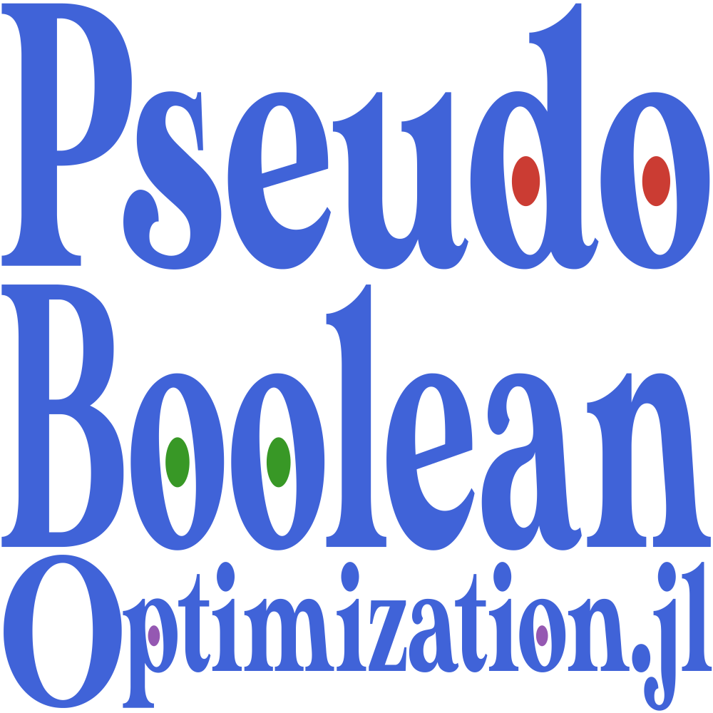

# PseudoBooleanOptimization.jl's Assets

## [Logo](@id logo)

PseudoBooleanOptimization's logo is yet to be designed.

## Colors

The colors were chosen according to *Julia's Reference for logo graphics*[^Julia].
Text color matches renders fairly well in both light and dark background themes.

## Typography
The *MADETYPE Sunflower*[^Sunflower] font was chosen.
It was converted to a SVG path using the *Google Font to Svg Path*[^DanMarshall] online tool.

[^Julia]:
    [github.com/JuliaLang/julia-logo-graphics](https://github.com/JuliaLang/julia-logo-graphics/)

[^Sunflower]:
    [Licensed](/docs/src/assets/fonts/Sunflower-LICENSE.txt) by the authors for use in this project

[^DanMarshall]:
    [danmarshall.github.io/google-font-to-svg-path](https://danmarshall.github.io/google-font-to-svg-path/)